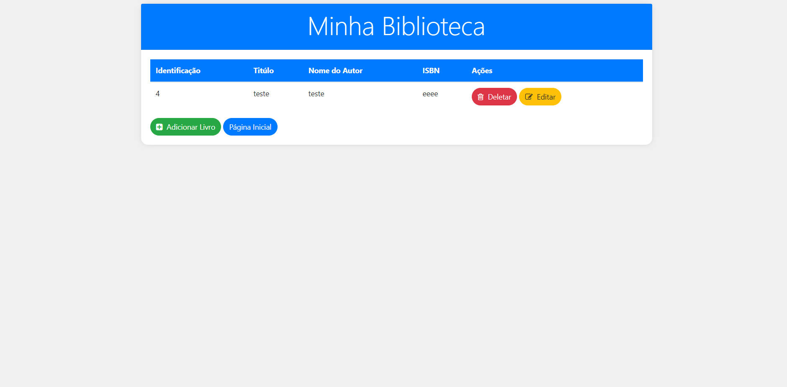

# Biblioteca - Projeto CRUD

Este é um projeto de exemplo para demonstrar um aplicativo de gerenciamento de biblioteca com funcionalidades básicas de CRUD (Create, Read, Update, Delete) usando Spring Boot.

## Pré-requisitos

Antes de começar, certifique-se de ter as seguintes ferramentas instaladas em sua máquina:

- [Java Development Kit (JDK)](https://www.oracle.com/java/technologies/javase-downloads.html) - Para executar o aplicativo Spring Boot.
- [Maven](https://maven.apache.org/) - Para gerenciar as dependências do projeto.
- [MySQL](https://www.mysql.com/) - Um banco de dados relacional para armazenar os dados da biblioteca.

## Configuração do Banco de Dados

Este projeto utiliza o MySQL como banco de dados. Você precisará criar um banco de dados chamado `biblioteca` antes de executar o aplicativo. As configurações do banco de dados podem ser encontradas em `src/main/resources/application.properties`. Certifique-se de atualizar as configurações de banco de dados com suas credenciais.

## Executando o Projeto

Para executar o projeto, siga estas etapas:

1. Clone o repositório para sua máquina:

2. Navegue até a pasta do projeto

3. Execute o aplicativo usando o Maven

O aplicativo será executado em `http://localhost:8080`. Você pode acessar a interface do aplicativo em seu navegador.

## Funcionalidades do CRUD

O aplicativo oferece as seguintes funcionalidades:

- **Adicionar Livro**: Adicione informações sobre um novo livro à biblioteca.
- **Listar Livros**: Veja uma lista de todos os livros na biblioteca.
- **Editar Livro**: Atualize as informações de um livro existente.
- **Deletar Livro**: Remova um livro da biblioteca.

## Tecnologias Utilizadas

- Spring Boot: Framework Java para desenvolvimento de aplicativos web.
- Thymeleaf: Um mecanismo de modelo para criar páginas web.
- MySQL: Banco de dados relacional.
- Bootstrap: Framework de front-end para estilização e design.

## Contribuindo

Sinta-se à vontade para contribuir com melhorias para este projeto. Basta criar um fork do repositório, fazer suas alterações e criar um pull request.

